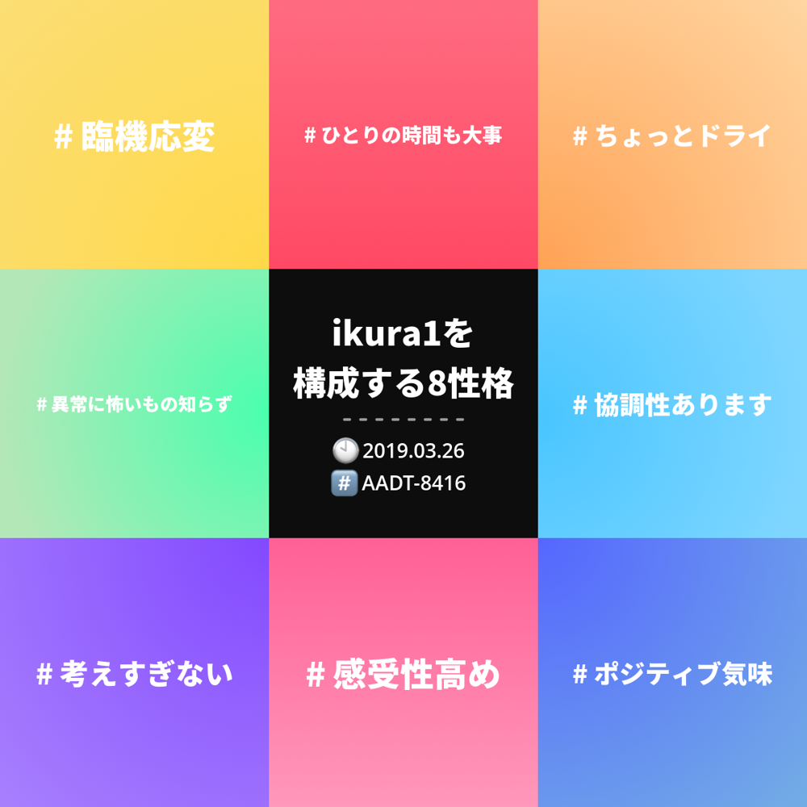

# 職務経歴書

## 基本情報

| key     | value                                            |
| ------- | ------------------------------------------------ |
| Name    | おくだ ゆうき (Okuda Yuki)                       |
| Birth   | 1992/02/28                                       |
| Address | 大阪                                             |
| Blog    | [ikura1's log](https://ikura-lab.hatenablog.com) |
| Qiita   | [@ikura1](https://qiita.com/ikura1)              |
| Github  | [@ikura1](https://github.com/ikura1)             |
| Twitter | [@ikura1](https://twitter.com/ikura1)            |
| conpass | [@ikura1](https://connpass.com/user/ikura1/)     |
| AtCoder | [ikura1](https://atcoder.jp/users/ikura1)        |
| Google  | [ikura](https://g.dev/ikura1)                    |

### 性格

| key          | value                                                                               |
| ------------ | ----------------------------------------------------------------------------------- |
| 16Person     | [巨匠](https://www.16personalities.com/ja/istp%E5%9E%8B%E3%81%AE%E6%80%A7%E6%A0%BC) |
| エニアグラム | [芸術家](https://t.co/1jQK9Mq7Pi)                                                   |
| HSP          | [弱](https://hsptest.jp/score/42)                                                   |
| エムグラム   | [詳細ページ](https://mgram.me/ja/share/Lapj7aiHm835gC_pWgb)                         |

### 情報収集の媒体

- Podcast
  - 技術系全般を雑多に聞いています
  - Rebuild, omoiyari.fm, emfm, Fukabori.fm
- はてなブックマーク
  - 人気エントリーとマイホットエントリーを読みます
  - スライドやブログ・技術を知るきっかけにしてます
- Twitter
  - エンジニアの人をフォローしており、スライドやブログ・技術を知るきっかけにしてます
- Github Trend
  - Python の Daily Trend を見てます
  - 気になるのがあると、試す形です
- 勉強会
  - その時追っ掛けている技術の勉強会に参加
    - Python・機械学習やアジャイル系が多い
  - モチベーションの維持や知識のきっかけにしている

## スキル

### 言語

- Python
- TypeScript

### その他

- Git
- Docker
- チーム開発促進
  - ふりかえり
  - カンバン

## 職務経歴

### 2022/07 - 現在 : フォルシア株式会社

Join

### 2019/10 - 2022/06 : フリーランス

Python エンジニアとして、以前に勤めていた会社からのお仕事をメインに開発を行っていました。

#### 業務内容

- 設計・開発
- 使用技術
  - Python
  - PyQt
  - QGIS
  - OpenCV

### 2018/05 - 2019/09 : 株式会社 グラッドキューブ

_広告代理店_
_職務: 機械学習エンジニア_
メディアサイトの機械学習に関わる部分(データ・バックエンド・インフラ)を担当しています。
また、関れる範囲で様々なことを行ってきました。

#### 業務内容

- 機械学習モデルの作成
- バックエンドの開発
- データベース設計・運用
- 開発環境改善
- チームビルディング
  - ふりかえりやカンバンの導入
- 使用技術
  - Python
  - jupyter notebook
  - flask
  - lightGBM
  - MariaDB

##### 機械学習モデルの開発

- Pipenv での開発環境構築

  - requirements.txt が存在しない状態だった
  - Python の環境構築を簡易に行えるようにするために、Pipenv での環境構築を行った

- Rundeck を用いたバッチ処理の自動化

  - バッチ処理は cron で行われていた
  - ジョブごとの依存関係や管理のしやすさから Rundeck に移行した
  - 他の候補としては、Luigi や AirFlow があった

- flask での API サーバー構築

  - bottle でのサーバーが構築されていたが、不安定で時折落ちていた
  - 資料が多く軽量な flask への移行を行った

- lightgbm でのモデル作成

  - 既存モデルが RandomForest で作成されていた
  - kaggle でメジャーで資料がある lightgbm で、モデルを作成した
  - kaggle の karnel を参考に特徴量エンジニアリングや不均衡データへの対策を行った

##### 開発環境改善

- Bitbucket Pipeline を使っての Docker Image の自動ビルド

  - チャット Bot への指示で実行されていました
  - jenkins の管理者が不在で不安定になっていたので移行した
  - Bitbucket Pipeline を使用した理由は、CI の知識が不足していたためである

- Rundeck によるデプロイの簡略化

  - ssh し docker-compose.yml を変更する形で行われていた
  - ヒューマンエラーの温床となっていた
  - またリーダーしかリリースを行っていなかった(トラック No1)
  - 自分ができる範囲の簡略化として、Rundeck にデプロイフローを登録し簡略化を行った

- codacy を使用しての自動コードレビュー

  - 機械学習・Python の知識があるエンジニアがチームに自分しかいなかった
  - codacy を導入し、１人で簡易なコードレビューを行える環境を構築した

##### チームビルディング

- ふりかえりの再発進

  - 形骸化して 2 ヶ月間ふりかえりが行われなかった
  - 改善の起点として、ふりかえりを行う必要を感じていた
  - リーダーに掛け合い場を設置し、2 週間間隔でふりかえりを開催した
  - ファシリテーターとして、ふりかえりを実施している
  - 方法は KPT がメインで、まれに他の方法(YWT,FDL,闇鍋)で実施している

- カンバンの設置

  - タスクを管理が公開されておらず、タスクの状況が不明だった
  - ふりかえりでタスク管理の問題を上げた
  - 候補として、Trello や Redmine・ホワイトボード
  - 物理的で視認性が高いホワイトボードでカンバンを始動させた

- 安全性のあるチャットグループの作成

  - 雑談ができるグループが存在しなかった
    - 業務報告のグループしか存在せず、発言がしにくい環境にあった
  - 情報共有場として、チャットグループを作成した
    - 雑談が目的のグループであることを周知し安全を確保した
    - 他のメンバーに発言してもらうため、率先して取り留めもないことを発言した
      - 野球観戦
      - 興味のある記事
      - 参加する勉強会
  - 分報を考えたが Chatwork で運用されているため、没案になった

- Vein の導入

  - エンジニア間でもページの共有やコミュニケーションがあまり行われていなかった
  - Vein という魅力的なサービスが始まったので、暗黙知の共有として導入した

- チームでワーク
  - 月 1 でのワークショップ
  - 月 1 でのふりかえりに使用していた枠が空いたので、ワークショップや議論の場として利用
  - カイゼン・ジャーニーや見聞きしたことから様々なことを実施
    - ドラッガー式エクササイズ
    - ふりかえり: 闇鍋
    - タスク管理について
    - ふりかえり: FDL

#### 転職理由

- 同じ技術領域のエンジニアがいない
  - 成長速度の鈍化
    - Python や機械学習のエンジニアが存在せず、１人で業務を行っている時間が大半

### 2014/04 - 2018/04 : 株式会社 Geo ソリューションズ

_測量会社_
_職務: システムエンジニア_
QGIS という OSS のプラグインを社内社外に向けて一人で開発を行っていました。
簡単な目的が伝えられ、要件定義と UI 設定を行い開発という流れでした。
測量ソフトのプラグインというニッチな技術のため、公式のリファレンスしか存在しないためリファレンスを読みつつ一人で開発を行っていました。

#### 業務内容

- 要件定義
- 設計・開発
- データベース設計
- 使用技術
  - Python
  - PyQt
  - PostgreSQL

#### 転職理由

- 一人での開発に限界を感じた
  - 開発メンバー一人一人が別案件が取り扱っているため、業務は１人で実施していた
  - 誰かと一緒に働き、互いに知識を吸収できる環境で働いてみたかった
- 新しい分野へ挑戦したかった
  - 開発人数が増えないこともあり、同じ作業が増えていた
- チームで楽しく働きたかった
  - アジャイルに興味があった
